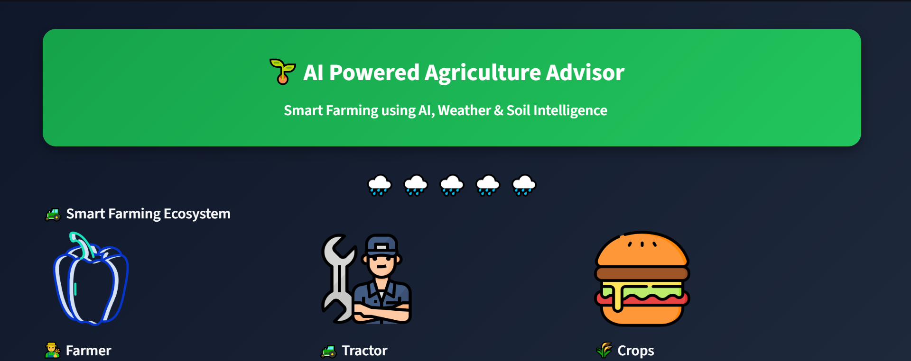
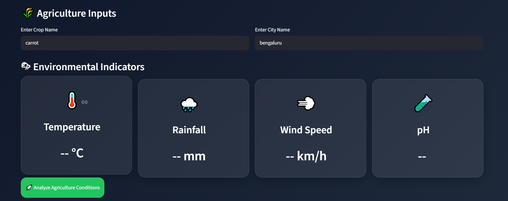
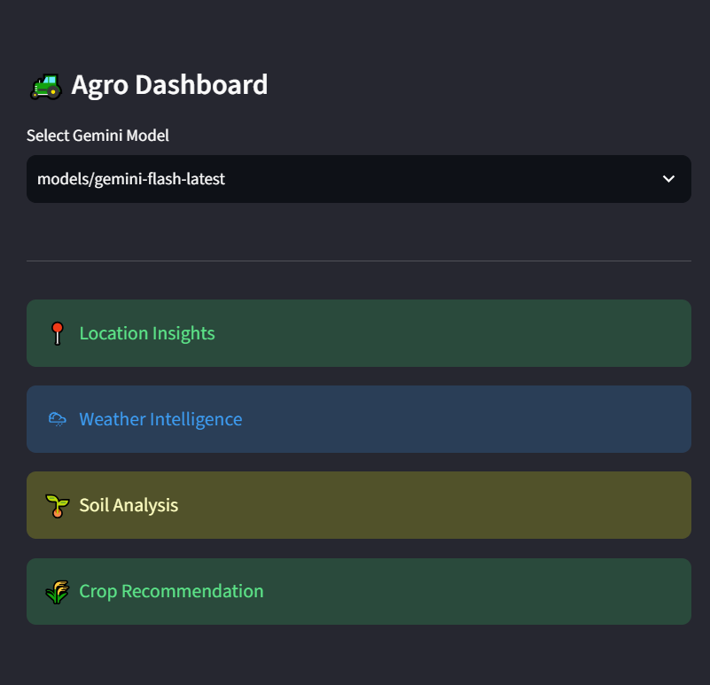
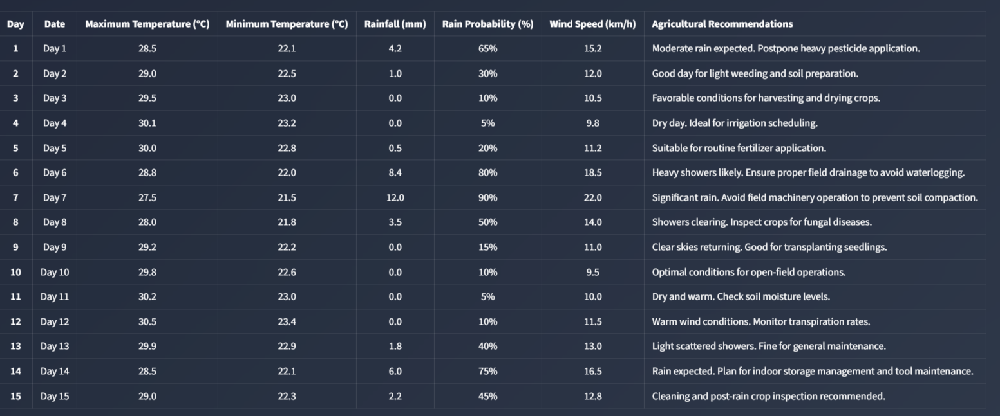
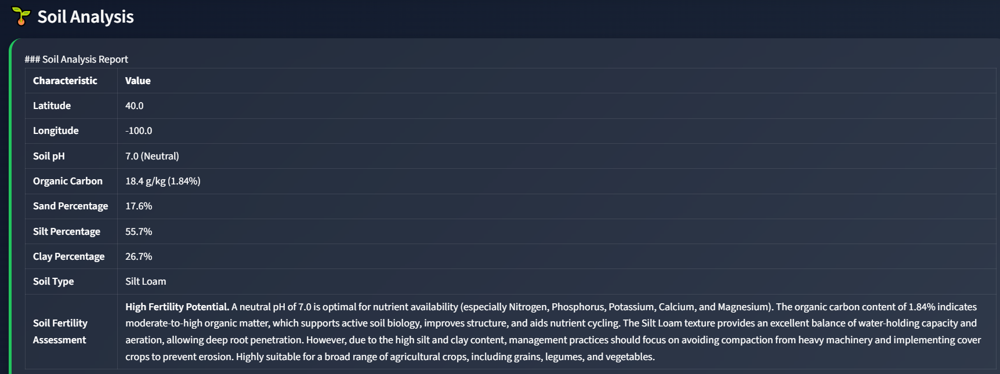
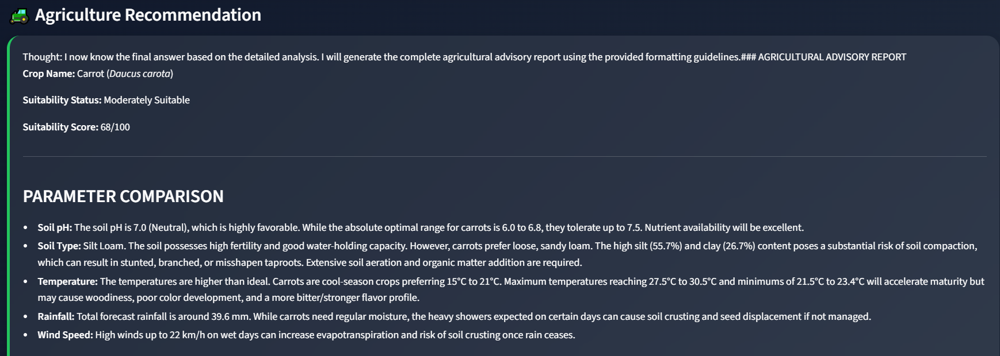
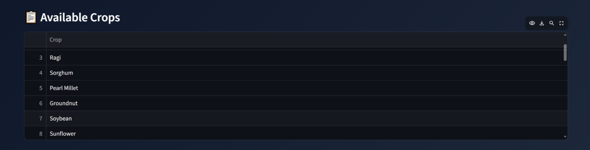
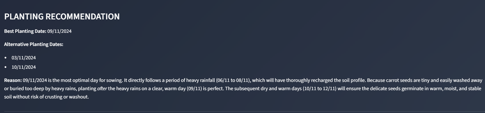
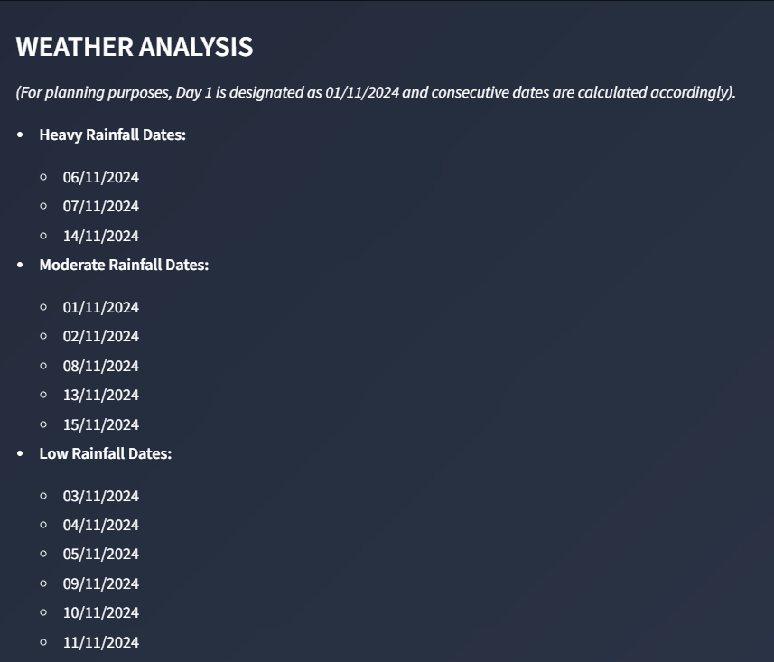
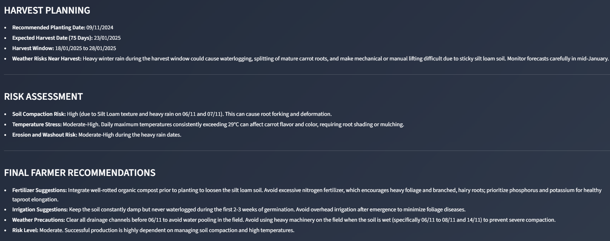

# 🌱 AI-Powered Agriculture Advisor

An intelligent multi-agent agriculture advisory system that helps farmers make data-driven decisions using AI, weather forecasting, soil analysis, and location intelligence.

## 🚀 Live Demo

🔗 Streamlit App: https://ai-powered-agriculture-advisor.streamlit.app/

---

## 📌 Project Overview

AI-Powered Agriculture Advisor is a Streamlit-based application that combines multiple AI agents to provide personalized agricultural recommendations.

The system collects:

- 📍 Location information
- 🌦 Weather data from Open-Meteo
- 🌱 Soil data from SoilGrids
- 🤖 AI-powered crop recommendations using Gemini

Based on these inputs, the application provides:

- Best crop recommendations
- Planting schedules
- Irrigation planning
- Harvest predictions
- Rainfall analysis
- Farming insights and recommendations

---

## ✨ Features

### 📍 Location Agent
- Detects geographical location
- Retrieves latitude and longitude
- Identifies state and population details

### 🌦 Weather Agent
- Fetches real-time weather information
- Temperature analysis
- Rainfall prediction
- Climate suitability assessment

### 🌱 Soil Agent
- Retrieves soil characteristics using SoilGrids API
- Soil texture analysis
- Soil fertility insights
- Agricultural suitability recommendations

### 🤖 Gemini AI Agent
- Uses Google Gemini for intelligent agricultural reasoning
- Generates personalized farming recommendations
- Suggests suitable crops and cultivation strategies

### 🌾 Agriculture Advisory System
Provides:

- Crop recommendations
- Planting dates
- Irrigation schedules
- Harvest timelines
- Rainfall-based alerts
- Risk assessment

---

## 🏗 System Architecture

User Input
↓
Location Agent
↓
Weather Agent (Open-Meteo API)
↓
Soil Agent (SoilGrids API)
↓
Gemini AI Analysis
↓
Agriculture Recommendations

---

## 🛠 Technologies Used

### Frontend
- Streamlit

### Backend
- Python

### AI/LLM
- Google Gemini API

### APIs
- Open-Meteo API
- SoilGrids API

### Libraries
- CrewAI
- Pandas
- Requests

---

## 📸 Screenshots

### Home Page


### User Input Dashboard


### Gemini Model Dashboard


### Location Agent


### Weather Agent


### Soil Agent


### Agriculture Agent


### Crop Recommendation


### Planting Recommendation


### Rainfall Analysis


### Final Agriculture Advisory Result


---

## ▶️ Run the Application

```bash
streamlit run app.py
```

---

### Connect with Me

- GitHub: https://github.com/vimaladhithya
- LinkedIn: https://www.linkedin.com/in/vimaladhithya-a-p/

---
